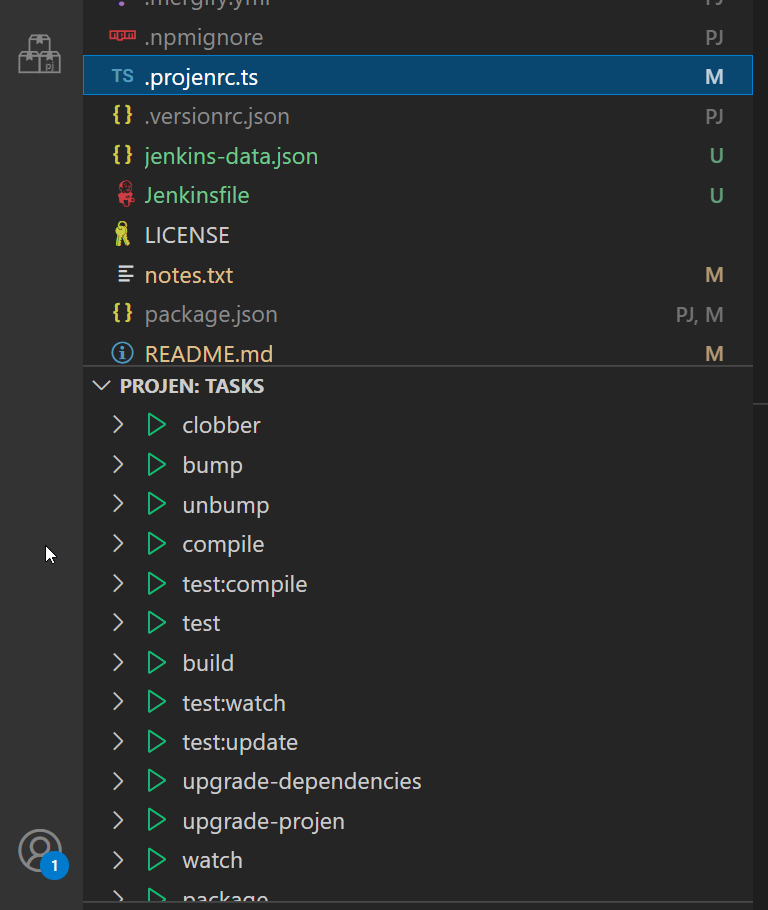
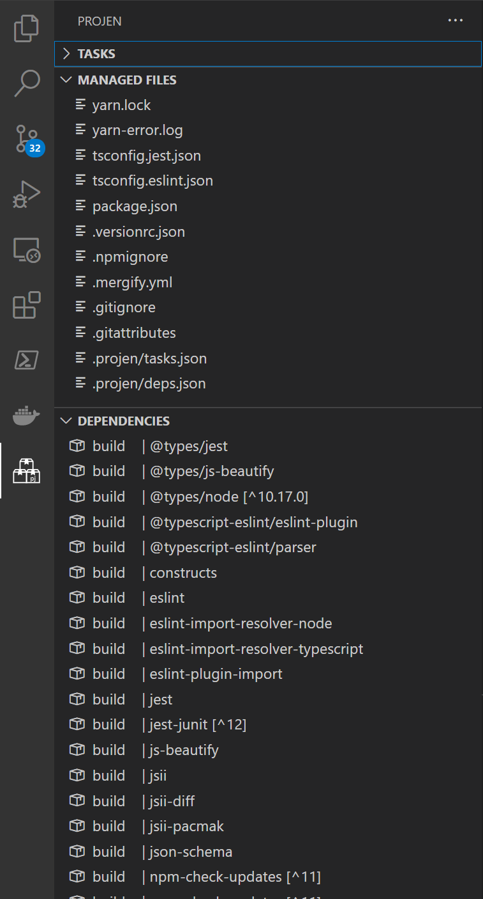
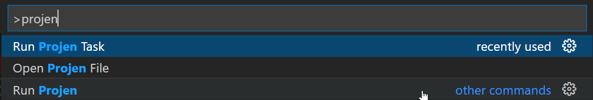

# Projen + VSCode = 💖

Add some [projen](https://github.com/projen/projen) flavor to VSCode!

*Currently in preview*

## Features

- Commands
  - Run projen
  - Run tasks
  - Generate new project
  - Generate new project from external type
- Task List
  - Run tasks in list with a click
  - List steps and subtasks (and their steps too)
- Dependency List
  - List packages with types and pinned versions
- Managed Files (Currently incomplete to avoid checking too many files)
  - Show list of files managed by projen (either directly or indirectly, like a lockfile)
  - De-emphasize files managed by projen in explorer and decorate it with "PJ"

## Screenshots

## Changelog

Changelog is kept via [GitHub Releases](https://github.com/MarkMcCulloh/vscode-projen/releases).

## Current Limitations

- Only works in a single-folder workspace with a projen project at the root
- "Managed Files" only refers to files in the root and in the `.projen` folder (to avoid searching too many files)

## Planned Features

See [[Feature]](https://github.com/MarkMcCulloh/vscode-projen/issues?q=is%3Aissue+is%3Aopen+label%3Aenhancement)s in the [GitHub issues list](https://github.com/MarkMcCulloh/vscode-projen/issues).
