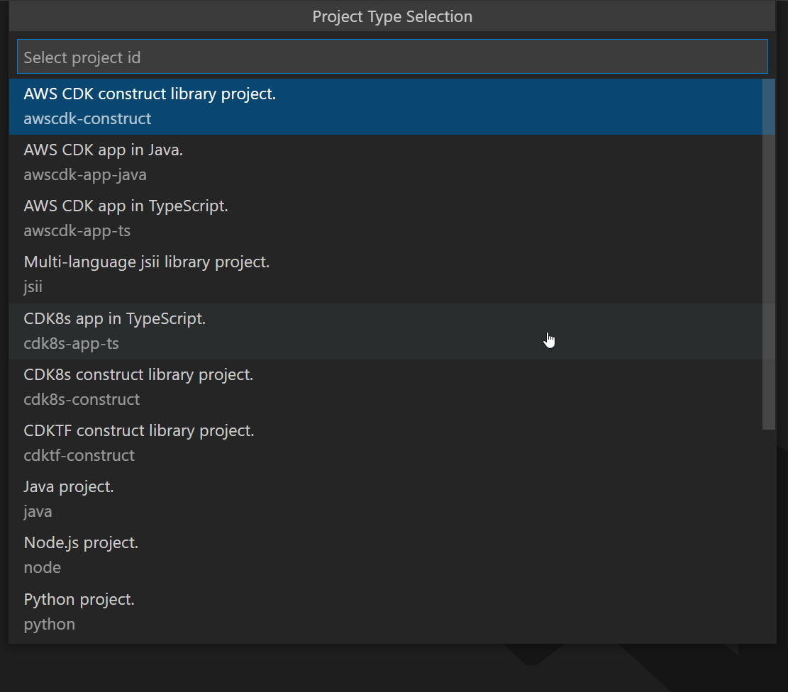

# Projen + VSCode = 💖

Add some [projen](https://github.com/projen/projen) flavor to VSCode!

## Features

- Commands
  - Run projen
  - Run tasks
  - Generate new project
  - Generate new project from external type
- Task List
  - Run tasks in list with a click
  - List steps and subtasks (and their steps too)
- Dependency List
  - List packages with types and pinned versions
- Managed Files/Folders
  - Show list of files managed by projen (either directly or indirectly, like a lockfile)
  - De-emphasize files managed by projen in explorer and decorate it with a "PJ" badge

## Changelog

Changelog is kept via [GitHub Releases](https://github.com/MarkMcCulloh/vscode-projen/releases).

## Screenshots

